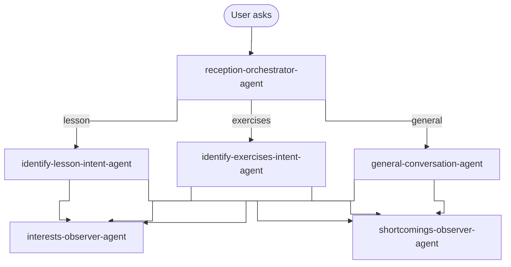
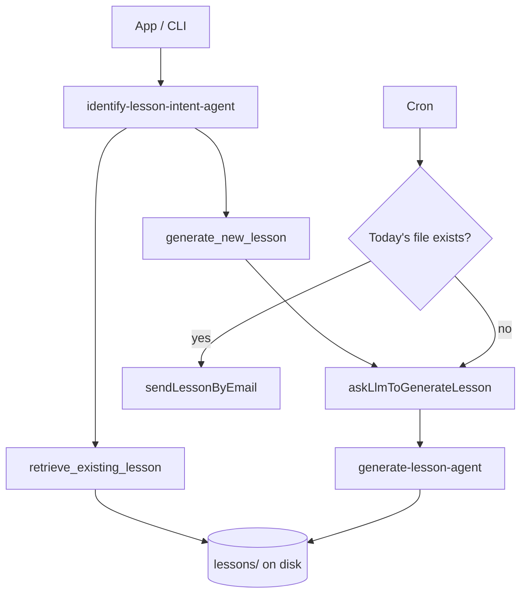
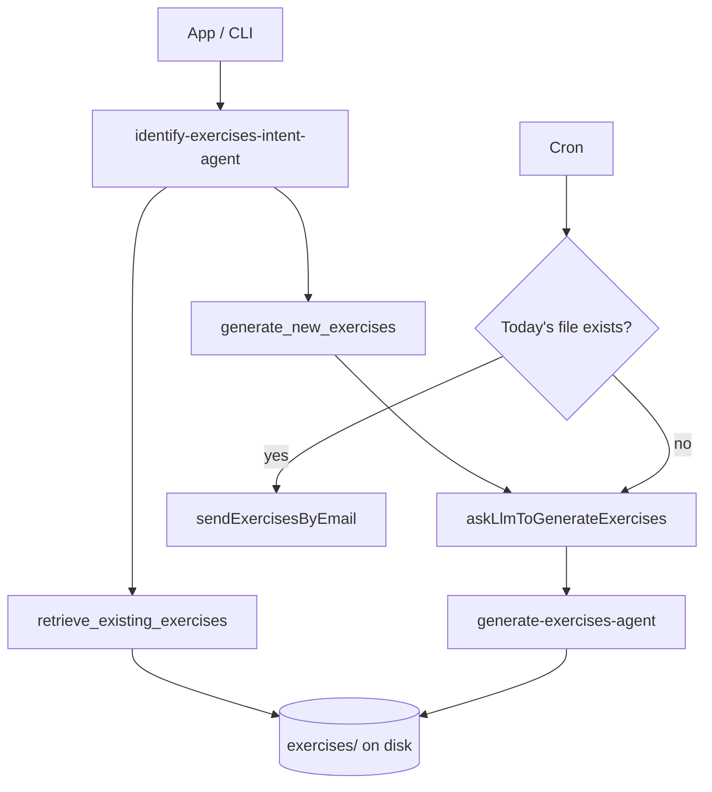

# Gio-System

Gio-System is a personal language-learning assistant. Talk or type to practice conversation, request lessons and exercises from your study plan, and optionally receive them by email on a schedule.

The app combines a multimodal **conversation assistant** (voice, text, and images via `gpt-realtime-1.5`) with dedicated **lesson** and **exercises** agents that read `study-plan.md`, save output as dated markdown files, and mark completed plan items.

---

## Index

- [Requirements](#requirements)
- [Installation](#installation)
- [Personal configuration](#personal-configuration)
- [Usage](#usage)
- [How routing works](#how-routing-works)
- [Interface](#interface)
- [Agents](#agents)
- [Project structure](#project-structure)
- [Environment variables](#environment-variables)
- [Security](#security)
- [License](#license)

---


## Requirements

- [Node.js](https://nodejs.org/) **24.7** or later (runs `.ts` files directly; no frontend build step)
- [npm](https://www.npmjs.com/) **11.5** or later
- An OpenAI API key with access to multimodal models (for example `gpt-realtime-1.5`, `gpt-4o-mini-transcribe`) and the Agents API used for lessons and exercises

---


## Installation

```bash
npm install
cp .env.example .env
cp student-context.example.md student-context.md
cp disambiguation.example.md disambiguation.md
```

Create `study-plan.md` in the project root (the file is gitignored). This is the curriculum the lesson and exercises agents follow — entries organized by day, with theoretical topics and practice items using checkbox lines the agents can mark as completed.

Edit `.env` and set at least your API key:

```env
OPENAI_API_KEY=sk-...
```

Restart the server after changing `.env`, `student-context.md`, `disambiguation.md`, `study-plan.md`, or plugins under `plugins/`.

Run tests (live OpenAI calls on every run — uses tokens; needs `OPENAI_API_KEY` in `.env`):

```bash
npm test
```

Unit tests finish in under a second; two integration tests call the lesson agent against real API (~6–7 s total). Look for the `study output LLM integration` suite and `56` passing tests.

---


## Personal configuration


### Study plan

`study-plan.md` drives lesson and exercise generation. Structure it by month and day; use `- [ ]` / `- [x]` checkboxes for items the agents can mark via `mark_study_plan_items`.

Generated content is saved under:

- `lessons/YYYY-MM-DD.md`
- `exercises/YYYY-MM-DD.md`

Both folders are gitignored.

### Student context

Copy `student-context.example.md` to `student-context.md` (gitignored) and edit it for your learning profile: native language, target language, level, goals, and how you want the tutor to behave.

The file is appended to the conversation assistant's instructions and also informs **interests-observer-agent** after each turn.

Optional: set `STUDENT_CONTEXT_PATH` in `.env` to use a different file.

### Disambiguation

Copy `disambiguation.example.md` to `disambiguation.md` (gitignored). List words and spellings that voice transcription often gets wrong — names, place names, app terms, or phrases you say in your native language (for example `Gio-System — this app name` or `SCV — my company, not "ese ce ve"`).

The file is loaded into:

- the conversation assistant's instructions (full file)
- the transcription prompt for `gpt-4o-mini-transcribe` (first 1024 characters)

Put the most important terms first if the file is long.

Optional: set `DISAMBIGUATION_PATH` in `.env` to use a different file.

### Interests

After lesson, exercises, or conversation turns, a background agent may append language-learning topics you expressed interest in to `interests.md` (gitignored). Use this as a running list of themes to revisit in future lessons or conversation.

The observer reads `student-context.md` to infer your target language and goals, and skips duplicates already in the file.

### Shortcomings and opportunities

After the same turns, **shortcomings-observer-agent** may append mistakes and practice gaps to `shortcomings.md` (gitignored). Each entry is tagged **shortcoming** (a clear error) or **opportunity** (a gap worth revisiting). Use this file as memory for future lessons and tutoring focus.

### Email delivery

When SMTP is configured in `.env`, the system can send lessons, exercises, and the daily news digest by email — from the UI (when you ask), from CLI scripts, and from the cron job.

Set `NEWS_NEWSPAPER_URL` to the homepage of a newspaper to enable **news-agent** in the cron job (9:00 local, same as lessons and exercises). It reads `interests.md` and `student-context.md`, uses OpenAI **web search** (scoped to that site's domain) to find **one** uplifting article, **rewrites** it as graded reading in the **target language** (not a native-language summary), saves it under `news/YYYY-MM-DD.md`, and emails it.

Manual run: `npm run news`

See [Environment variables](#environment-variables) for SMTP and news settings.

### Plugins

Local plugins live in the gitignored `plugins/` folder. Each plugin is a subdirectory with an `index.ts` that exports `tools`:

```typescript
export const tools = [ /* conversation tool definitions */ ];
```

Copy from `plugins.example/hello/` to try the sample `echo` plugin:

```bash
mkdir -p plugins
cp -R plugins.example/hello plugins/hello
```

Restart the server after adding or removing plugins.

Optional: set `PLUGINS_DIR` in `.env` to use a different folder.

---


## Usage


### Desktop app (recommended)

```bash
npm start
```

Electron starts the Express server in the background and opens the Gio-System window.

### Web server only

```bash
npm run server
```

Open [http://localhost:3001](http://localhost:3001) in your browser.

### CLI

Main entry — routes through **reception-orchestrator-agent** like the app, then runs the lesson or exercises agent when triaged:

```bash
npm run gio -- give me today's lesson
npm run gio -- I want to practice verb conjugation
```

If the orchestrator routes to **general**, the CLI prints the route and points you to the web app (`npm run server`) for open conversation.

Direct shortcuts skip the orchestrator — `npm run lesson` always runs **identify-lesson-intent-agent**, `npm run exercises` always runs **identify-exercises-intent-agent**:

```bash
npm run lesson                           # default: today's lesson
npm run lesson -- repeat yesterday's lesson

npm run exercises                        # default: today's exercises
npm run exercises -- show me last week's drills
```


### Cron job

Run a background scheduler that checks at **9:00** (local time) whether to email today's lesson and exercises:

```bash
npm run cronjob
```

If today's file already exists on disk, the cron job re-emails the saved content instead of calling OpenAI again.

### Lint

```bash
npm run lint
npm run lint:fix
```

---


## How routing works

Every user message in the **app** goes through **reception-orchestrator-agent** (`agent-reception-orchestrator.ts`) first — it triages to lessons, exercises, or **general-conversation-agent**:




1. **identify-lesson-intent-agent** — figure out what the user wants regarding lessons, then retrieve or generate.
2. **identify-exercises-intent-agent** — figure out what the user wants regarding exercises, then retrieve or generate.
3. **General** — open conversation, language Q&A, email requests, etc. Handled by **general-conversation-agent**.

**reception-orchestrator-agent** is a lightweight routing agent (no tools): one SDK call returns `general`, `lesson`, or `exercises`. Lesson and exercises paths then run their dedicated agents.

**CLI** (`npm run gio`) runs reception-orchestrator-agent first, then the routed agent. `npm run lesson` / `npm run exercises` and the **cron job** skip the orchestrator — intent is fixed by which command or schedule runs.

The cron job checks the filesystem directly and calls the generator only when today's file is missing, avoiding an API call on every hourly tick.

Server logs include the full user prompt sent to OpenAI, prefixed with `[gio-system:prompt]`.

After each lesson, exercises, or conversation turn completes, **interests-observer-agent** may append new topics to `interests.md` and **shortcomings-observer-agent** may append mistakes and opportunities to `shortcomings.md`, both in the background.

---


## Interface

- **Microphone** — hold to speak; PCM audio is sent over WebSocket (`/ws`) to the server, which forwards it to the OpenAI Realtime API for transcription and response.
- **Text field + Send** — type a question or instruction; sent via `POST /turn` or the WebSocket for voice turns with typed context.
- **Camera** — attach a photo; the agent can read handwritten notes or diagrams in the image.

The history panel shows what you said or typed, tool actions that ran, and the assistant's reply. Completed lesson and exercise replies are rendered as **markdown** (headings, lists, emphasis). While a response is still streaming, text appears as plain pre-wrapped text until the turn finishes.

While recording, the live preview uses the browser's speech engine. After you release the mic, the server transcript comes from `gpt-4o-mini-transcribe` and may differ from the live preview.

---


## Agents

Lessons and exercises each use two agents with different jobs: one identifies intent and retrieves or triggers generation (**identify-lesson-intent-agent** / **identify-exercises-intent-agent**), another writes new content from the study plan (**generate-lesson-agent** / **generate-exercises-agent**). A retrieve-only turn never calls the generator. The cron job calls the generator directly when today's file is missing.

### Lessons — who calls which agent

**App** (after reception routes to `lesson`), **CLI** (`npm run lesson`), and **cron** each enter at a different point. Only the identify agent uses the `generate_new_lesson` tool; cron skips it and calls the generator function directly when today's file is missing.




### Exercises — who calls which agent

Same shape as lessons: identify agent for app/CLI, cron bypasses identify and reads disk first.




| Agent                               | When it runs                                                                  | Tools                                                      |
| ----------------------------------- | ----------------------------------------------------------------------------- | ---------------------------------------------------------- |
| **reception-orchestrator-agent**    | App: first triage on every user message                                       |                                                            |
| **identify-lesson-intent-agent**    | App (lesson route), CLI (`npm run lesson`)                                    | - `retrieve_existing_lesson` - `generate_new_lesson`       |
| **generate-lesson-agent**           | When `generate_new_lesson` runs; cron if today's lesson file is missing       | - `mark_study_plan_items` - `send_email`*                  |
| **identify-exercises-intent-agent** | App (exercises route), CLI (`npm run exercises`)                              | - `retrieve_existing_exercises` - `generate_new_exercises` |
| **generate-exercises-agent**        | When `generate_new_exercises` runs; cron if today's exercises file is missing | - `mark_study_plan_items` - `send_email`*                  |
| **interests-observer-agent**        | Background after each turn                                                    | - `save_interest`                                          |
| **shortcomings-observer-agent**     | Background after each turn                                                    | - `save_shortcoming`                                       |
| **news-agent**                      | Cron (when `NEWS_NEWSPAPER_URL` set), CLI (`npm run news`)                    | - `web_search` (hosted)                                    |
| **general-conversation-agent**      | App: general route (voice, text, images)                                      | - Plugin tools from `plugins/`                             |


- `send_email` only when SMTP is configured in `.env`.

**CLI** (`npm run gio`) runs reception-orchestrator-agent first; `npm run lesson` / `npm run exercises` skip it. **Cron** skips the orchestrator and calls the generator agents directly when files are missing.

### Tool reference


| Tool                          | Used by                                         | Action                                                           |
| ----------------------------- | ----------------------------------------------- | ---------------------------------------------------------------- |
| `retrieve_existing_lesson`    | identify-lesson-intent-agent                    | Load a saved lesson file by date                                 |
| `generate_new_lesson`         | identify-lesson-intent-agent                    | Starts **generate-lesson-agent**                                 |
| `retrieve_existing_exercises` | identify-exercises-intent-agent                 | Load saved exercises by date                                     |
| `generate_new_exercises`      | identify-exercises-intent-agent                 | Starts **generate-exercises-agent**                              |
| `mark_study_plan_items`       | generate-lesson-agent, generate-exercises-agent | Check off covered study-plan entries                             |
| `send_email`                  | generate-lesson-agent, generate-exercises-agent | Send email when the user asks during lesson/exercises generation |
| `save_interest`               | interests-observer-agent                        | Append a language-learning topic to `interests.md`               |
| `save_shortcoming`            | shortcomings-observer-agent                     | Append a mistake or practice opportunity to `shortcomings.md`    |
| `fetch_web_page`              | — (reserved; see `lib/fetch-web-page.ts` for non-OpenAI providers) | Local HTTP fetch alternative to hosted `web_search`              |
| `web_search`                  | news-agent                                      | Hosted OpenAI web search, scoped to the newspaper domain         |
| Plugin tools                  | general-conversation-agent                      | Defined by each plugin under `plugins/`                          |


---


## Project structure

```
gio-system/
├── agent-reception-orchestrator.ts # reception-orchestrator-agent + route types (`OrchestratorRoute`)
├── agent-lessons.ts         # identify-lesson-intent-agent, generate-lesson-agent, CLI entry
├── agent-exercises.ts       # identify-exercises-intent-agent, generate-exercises-agent, CLI entry
├── agent-interests.ts       # interests-observer-agent (background after each turn)
├── agent-shortcomings.ts    # shortcomings-observer-agent (background after each turn)
├── agent-news.ts            # news-agent (cron + npm run news)
├── student-context.example.md # Template for student-context.md
├── disambiguation.example.md # Template for disambiguation.md
├── cronjob.ts               # Lesson/exercises email scheduler (9:00 local)
├── server.ts                # Express server
├── study-plan.md            # Your curriculum (gitignored)
├── interests.md             # Saved learning topics (gitignored)
├── shortcomings.md          # Saved mistakes and practice gaps (gitignored)
├── news/                    # Saved daily news digests (gitignored)
├── lessons/                 # Saved lessons by date (gitignored)
├── exercises/               # Saved exercises by date (gitignored)
├── components/              # Vue UI (loaded at runtime, no bundler)
├── conversation/            # general-conversation-agent: session, instructions, turns
├── controllers/
│   ├── turn-http.ts         # POST /turn (text + optional image)
│   └── websocket.ts         # WebSocket /ws (voice turns)
├── electron/                # Electron main process
├── lib/
│   ├── ask-agent.ts         # askAgentAndLog — agent turn with logging
│   ├── resolve-agent-output.ts # Parse retrieve/generate tool results
│   ├── agent-tool-outputs.ts  # Extract tool payloads from agent traces
│   ├── agent-run-trace.ts   # Token and tool-call logging per invocation
│   ├── student-context.ts     # Loader for student-context.md
│   ├── disambiguation.ts    # Loader for disambiguation.md
│   ├── plugins.ts           # Loader for plugins/
│   ├── tools.ts             # Conversation tool types and helpers
│   ├── workspace.ts         # Project root path
│   ├── save-study-output.ts # Read/write dated lesson and exercise files
│   ├── save-interests.ts    # Read/write interests.md
│   ├── save-shortcomings.ts # Read/write shortcomings.md
│   ├── save-news-output.ts  # Read/write news/YYYY-MM-DD.md
│   ├── fetch-web-page.ts  # Local URL fetch (fallback if LLM provider changes)
│   └── study-plan-*.ts      # Study plan loading and marking
├── public/                  # Static assets (CSS, speech preview script)
├── tools/
│   ├── communication-tools/ # send_email
│   ├── interest-tools/      # save_interest (used by interests-observer-agent)
│   ├── shortcoming-tools/   # save_shortcoming (used by shortcomings-observer-agent)
│   ├── study-output-tools/  # retrieve / generate lesson & exercises
│   └── study-plan-tools/    # mark_study_plan_items
├── plugins.example/         # Sample plugin (copy into gitignored plugins/)
├── test/                    # Unit tests + live OpenAI integration tests
│   └── integration/         # Lesson retrieve/generate against real API
└── views/                   # Entry HTML (Vue + CDN loaders)
```

The frontend uses Vue 3 and `vue3-sfc-loader` from a CDN — `.vue` files are compiled in the browser. Markdown rendering in the history panel uses `marked` and DOMPurify from CDN as well.

---


## Environment variables


| Variable              | Description                                                 | Default             |
| --------------------- | ----------------------------------------------------------- | ------------------- |
| `OPENAI_API_KEY`      | OpenAI API key                                              | —                   |
| `STUDENT_CONTEXT_PATH`  | Path to personal student context markdown                     | `student-context.md`  |
| `DISAMBIGUATION_PATH` | Path to speech disambiguation terms                         | `disambiguation.md` |
| `SPEECH_PREVIEW`      | Browser speech preview while recording (`false` to disable) | enabled             |
| `PLUGINS_DIR`         | Folder for local plugins                                    | `plugins`           |
| `PORT`                | Express server port                                         | `3001`              |
| `SMTP_HOST`           | SMTP server hostname                                        | —                   |
| `SMTP_PORT`           | SMTP port                                                   | `587`               |
| `SMTP_SECURE`         | Use TLS (`true` / `false`)                                  | `false`             |
| `SMTP_USER`           | SMTP username                                               | —                   |
| `SMTP_PASS`           | SMTP password or app password                               | —                   |
| `SMTP_FROM`           | From address (defaults to `SMTP_USER`)                      | —                   |
| `NEWS_NEWSPAPER_URL`  | Newspaper homepage for daily news cron (`news-agent`)       | — (cron job off)    |


---


## Security

Gio-System is a **local language learning application**. It runs a server on your machine, stores your OpenAI API key in `.env`, and writes lessons, exercises, study-plan updates, and interests to the project directory.

Plugins in `plugins/` are local TypeScript modules loaded at startup. Only install plugins you trust — they run with the same privileges as the server.

Do not expose the server to the internet without proper authentication. Use it on `localhost` or a trusted network only.

---


## License

[ISC](LICENSE)