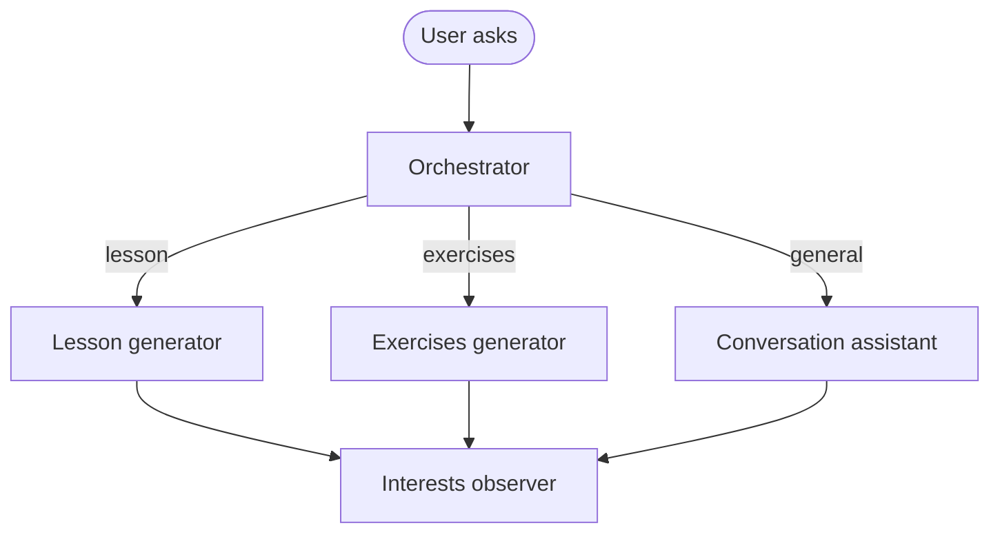

# Gio-System

Gio-System is a personal language-learning assistant. Talk or type to practice conversation, request daily lessons and exercises from your study plan, and optionally receive them by email on a schedule.

The app combines a multimodal **conversation assistant** (voice, text, and images via `gpt-realtime-1.5`) with dedicated **lesson** and **exercises** agents that read `study-plan.md`, save output as dated markdown files, and mark completed plan items.

------

## Index

- [Requirements](#requirements)
- [Installation](#installation)
- [Personal configuration](#personal-configuration)
- [Usage](#usage)
- [How routing works](#how-routing-works)
- [Interface](#interface)
- [Tools](#tools)
- [Project structure](#project-structure)
- [Environment variables](#environment-variables)
- [Security](#security)
- [License](#license)

------

## Requirements

- [Node.js](https://nodejs.org/) **24.7** or later (runs `.ts` files directly; no frontend build step)
- [npm](https://www.npmjs.com/) **11.5** or later
- An OpenAI API key with access to multimodal models (for example `gpt-realtime-1.5`, `gpt-4o-mini-transcribe`) and the Agents API used for lessons and exercises

------

## Installation

```bash
npm install
cp .env.example .env
cp agent-context.example.md agent-context.md
cp disambiguation.example.md disambiguation.md
```

Create `study-plan.md` in the project root (the file is gitignored). This is the curriculum the lesson and exercises agents follow — daily entries with theoretical topics and practice items, using checkbox lines the agents can mark as completed.

Edit `.env` and set at least your API key:

```env
OPENAI_API_KEY=sk-...
```

Restart the server after changing `.env`, `agent-context.md`, `disambiguation.md`, `study-plan.md`, or plugins under `plugins/`.

Run tests:

```bash
npm test
```

Optional live OpenAI integration tests (costs tokens):

```bash
npm run test:integration
```

------

## Personal configuration

### Study plan

`study-plan.md` drives lesson and exercise generation. Structure it by month and day; use `- [ ]` / `- [x]` checkboxes for items the agents can mark via `mark_study_plan_items`.

Generated content is saved under:

- `lessons/YYYY-MM-DD.md`
- `exercises/YYYY-MM-DD.md`

Both folders are gitignored.

### Agent context

Copy `agent-context.example.md` to `agent-context.md` (gitignored) and edit it for your learning profile: native language, target language, level, goals, and how you want the tutor to behave.

The file is appended to the conversation assistant's instructions and also informs the background **interests** observer after each turn.

Optional: set `AGENT_CONTEXT_PATH` in `.env` to use a different file.

### Disambiguation

Copy `disambiguation.example.md` to `disambiguation.md` (gitignored). List words and spellings that voice transcription often gets wrong — names, place names, app terms, or phrases you say in your native language (for example `Gio-System — this app name` or `SCV — my company, not "ese ce ve"`).

The file is loaded into:

- the conversation assistant's instructions (full file)
- the transcription prompt for `gpt-4o-mini-transcribe` (first 1024 characters)

Put the most important terms first if the file is long.

Optional: set `DISAMBIGUATION_PATH` in `.env` to use a different file.

### Interests

After lesson, exercises, or conversation turns, a background agent may append language-learning topics you expressed interest in to `interests.md` (gitignored). Use this as a running list of themes to revisit in future lessons or conversation.

The observer reads `agent-context.md` to infer your target language and goals, and skips duplicates already in the file.

### Email delivery

When SMTP is configured in `.env`, the system can send lessons and exercises by email — from the UI (when you ask), from CLI scripts, and from the daily cron job.

See [Environment variables](#environment-variables) for SMTP settings.

### Plugins

Local plugins live in the gitignored `plugins/` folder. Each plugin is a subdirectory with an `index.ts` that exports `tools`:

```typescript
export const tools = [ /* conversation tool definitions */ ];
```

Copy from `plugins.example/hello/` to try the sample `echo` plugin:

```bash
mkdir -p plugins
cp -R plugins.example/hello plugins/hello
```

Restart the server after adding or removing plugins.

Optional: set `PLUGINS_DIR` in `.env` to use a different folder.

------

## Usage

### Desktop app (recommended)

```bash
npm start
```

Electron starts the Express server in the background and opens the Gio-System window.

### Web server only

```bash
npm run server
```

Open [http://localhost:3001](http://localhost:3001) in your browser.

### CLI — lessons and exercises

Generate or retrieve content from the command line (uses the same orchestrator as the app):

```bash
npm run lesson                           # default: today's lesson
npm run lesson -- repeat yesterday's lesson

npm run exercises                        # default: today's exercises
npm run exercises -- show me last week's drills
```

### Daily cron job

Run a background scheduler that emails today's lesson and exercises at **9:00** (local time), once per day each:

```bash
npm run cronjob
```

If today's file already exists on disk, the cron job re-emails the saved content instead of calling OpenAI again.

### Lint

```bash
npm run lint
npm run lint:fix
```

------

## How routing works

Every user message goes through a single orchestrator (`lib/orchestrator.ts`) before the conversation assistant sees it:



1. **Lesson request** — retrieve a saved lesson or generate a new one from the study plan.
2. **Exercises request** — retrieve saved exercises or generate new ones.
3. **General** — open conversation, language Q&A, email requests, etc. Handled by the conversation assistant.

The orchestrator runs as one Agents SDK call with tools (`retrieve_existing_lesson`, `generate_new_lesson`, and the exercises equivalents). Lesson and exercises requests no longer require a separate routing step.

The cron job is a special case: it checks the filesystem directly and calls the generator only when today's file is missing, avoiding an API call on every hourly tick.

Server logs include the full user prompt sent to OpenAI, prefixed with `[gio-system:prompt]`.

After each lesson, exercises, or conversation turn completes, an interests observer may append new topics to `interests.md` in the background.

------

## Interface

- **Microphone** — hold to speak; PCM audio is sent over WebSocket (`/ws`) to the server, which forwards it to the OpenAI Realtime API for transcription and response.
- **Text field + Send** — type a question or instruction; sent via `POST /turn` or the WebSocket for voice turns with typed context.
- **Camera** — attach a photo; the agent can read handwritten notes or diagrams in the image.

The history panel shows what you said or typed, tool actions that ran, and the assistant's reply. Completed lesson and exercise replies are rendered as **markdown** (headings, lists, emphasis). While a response is still streaming, text appears as plain pre-wrapped text until the turn finishes.

While recording, the live preview uses the browser's speech engine. After you release the mic, the server transcript comes from `gpt-4o-mini-transcribe` and may differ from the live preview.

------

## Tools

### Orchestrator (automatic)

These run when you ask for lesson or exercise content in the app or via CLI. You do not invoke them directly.

| Tool | Action |
|------|--------|
| `retrieve_existing_lesson` | Load a saved lesson file by date |
| `generate_new_lesson` | Generate a new lesson from the study plan |
| `retrieve_existing_exercises` | Load saved exercises by date |
| `generate_new_exercises` | Generate new exercises from the study plan |

The generators also call `mark_study_plan_items` to check off covered plan entries.

### Conversation assistant (general chat)

When the orchestrator routes to general conversation, the conversation assistant may use:

| Tool | When available | Action |
|------|----------------|--------|
| `send_email` | SMTP configured in `.env` | Send an email when you ask |
| Plugin tools | `plugins/` folder | Defined by each plugin |

------

## Project structure

```
gio-system/
├── agent-lesson.ts          # Lesson generator + CLI entry
├── agent-exercises.ts       # Exercises generator + CLI entry
├── agent-interests.ts       # Background interests observer after each turn
├── agent-context.example.md # Template for agent-context.md
├── disambiguation.example.md # Template for disambiguation.md
├── cronjob.ts               # Daily lesson/exercises email scheduler
├── server.ts                # Express server
├── study-plan.md            # Your curriculum (gitignored)
├── interests.md             # Saved learning topics (gitignored)
├── lessons/                 # Saved lessons by date (gitignored)
├── exercises/               # Saved exercises by date (gitignored)
├── components/              # Vue UI (loaded at runtime, no bundler)
├── conversation/            # Conversation assistant: session, instructions, turns
├── controllers/
│   ├── turn-http.ts         # POST /turn (text + optional image)
│   └── websocket.ts         # WebSocket /ws (voice turns)
├── electron/                # Electron main process
├── lib/
│   ├── orchestrator.ts      # Unified routing: general / lesson / exercises
│   ├── agent-context.ts     # Loader for agent-context.md
│   ├── disambiguation.ts    # Loader for disambiguation.md
│   ├── plugins.ts           # Loader for plugins/
│   ├── tools.ts             # Conversation tool types and helpers
│   ├── workspace.ts         # Project root path
│   ├── save-study-output.ts # Read/write dated lesson and exercise files
│   ├── save-interests.ts    # Read/write interests.md
│   └── study-plan-*.ts      # Study plan loading and marking
├── public/                  # Static assets (CSS, speech preview script)
├── tools/
│   ├── communication-tools/ # send_email
│   ├── interest-tools/      # save_interest (used by interests observer)
│   ├── study-output-tools/  # retrieve / generate lesson & exercises
│   └── study-plan-tools/    # mark_study_plan_items
├── plugins.example/         # Sample plugin (copy into gitignored plugins/)
├── test/                    # Unit and integration tests
└── views/                   # Entry HTML (Vue + CDN loaders)
```

The frontend uses Vue 3 and `vue3-sfc-loader` from a CDN — `.vue` files are compiled in the browser. Markdown rendering in the history panel uses `marked` and DOMPurify from CDN as well.

------

## Environment variables

| Variable | Description | Default |
|----------|-------------|---------|
| `OPENAI_API_KEY` | OpenAI API key | — |
| `AGENT_CONTEXT_PATH` | Path to personal agent context markdown | `agent-context.md` |
| `DISAMBIGUATION_PATH` | Path to speech disambiguation terms | `disambiguation.md` |
| `SPEECH_PREVIEW` | Browser speech preview while recording (`false` to disable) | enabled |
| `PLUGINS_DIR` | Folder for local plugins | `plugins` |
| `PORT` | Express server port | `3001` |
| `SMTP_HOST` | SMTP server hostname | — |
| `SMTP_PORT` | SMTP port | `587` |
| `SMTP_SECURE` | Use TLS (`true` / `false`) | `false` |
| `SMTP_USER` | SMTP username | — |
| `SMTP_PASS` | SMTP password or app password | — |
| `SMTP_FROM` | From address (defaults to `SMTP_USER`) | — |

------

## Security

Gio-System is a **local language learning application**. It runs a server on your machine, stores your OpenAI API key in `.env`, and writes lessons, exercises, study-plan updates, and interests to the project directory.

Plugins in `plugins/` are local TypeScript modules loaded at startup. Only install plugins you trust — they run with the same privileges as the server.

Do not expose the server to the internet without proper authentication. Use it on `localhost` or a trusted network only.

------

## License

[ISC](LICENSE)
